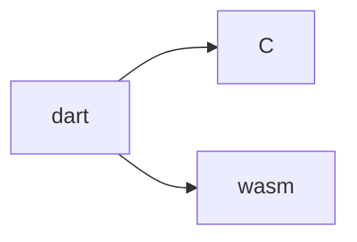

# mujoco

dart ffi for [MuJoCo](https://github.com/google-deepmind/mujoco)

## install

在虚拟环境中安装 mujoco

```bash
uv venv --python 3.8.10 --seed
pip install mujoco
```


## 目标

为了快速适配功能，目前采用的策略是


之后的方向是



- [ ] [hooks for wasm](https://github.com/dart-lang/native/issues/988)
