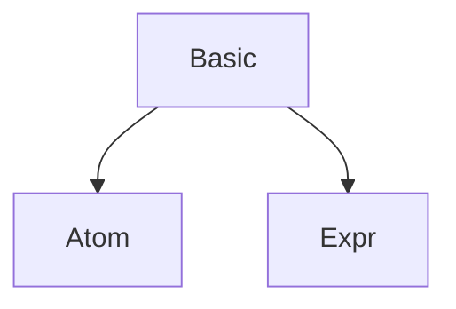

# sym

参考 [sympy](https://github.com/sympy/sympy)

## structure

```mermaid
graph TD
    A[Basic] --> B[Atom]
    A --> C[Expr]
```

- Atom: 不存在子表达式

    如：Symbol, Number, Integer, Rational

    但是 Mul, Add, Pow 等都不是 Atom，这些是操作符

